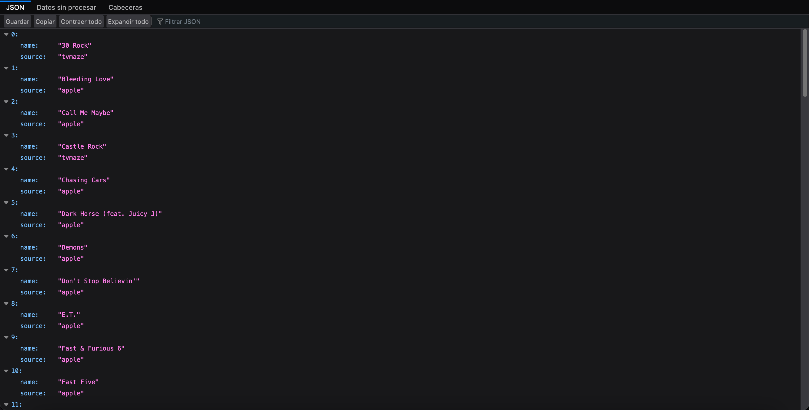
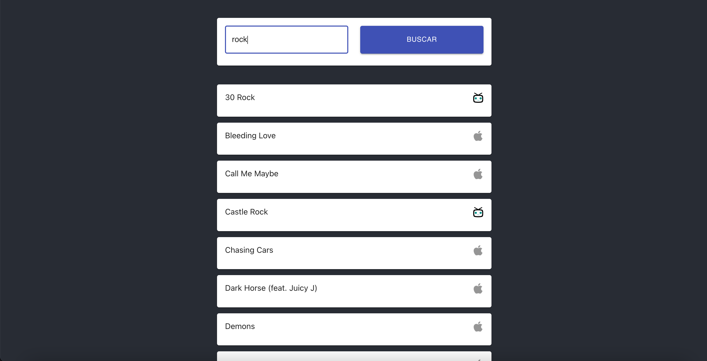

# Endpoint-app - Roger Sosa

Este ejercicio consta de una API REST en NodeJS

Un SPA en React para obtener los datos del API





## Demo URL en Heroku:

APP:

https://safe-earth-66082.herokuapp.com/


API:

https://safe-earth-66082.herokuapp.com/api?search=rock


## Instalación

```bash
git clone https://github.com/rogerthedeveloper/endpoint-app.git ENDPOINT_ROGER_SOSA
```
## Uso

```bash
cd ENDPOINT_ROGER_SOSA
npm run build && npm start
```

## Documentación

### API REST

URL:
https://safe-earth-66082.herokuapp.com/api

```
Method: GET

QueryParams: search = "TERMINO_A_BUSCAR"
```

### APP

URL:
https://safe-earth-66082.herokuapp.com/

## Headers

```
Content-Type: application/json
```

[link](url){:target="_blank"}